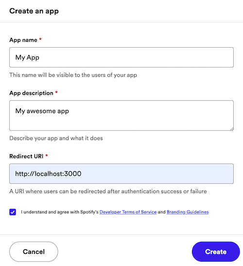
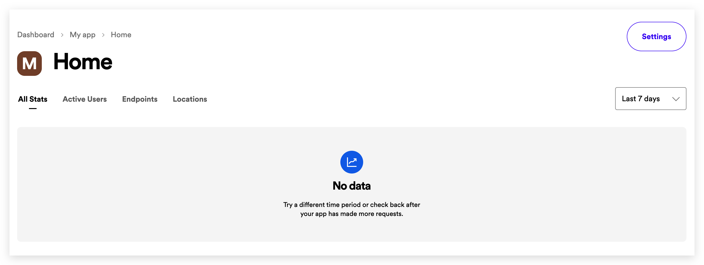
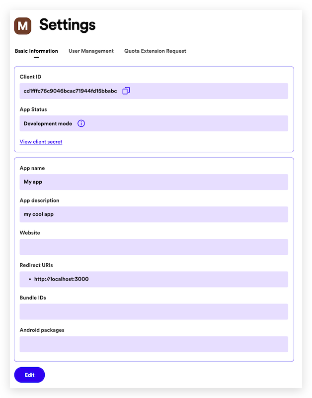

# Apps

The app provides, among others, the _Client ID_ and _Client Secret_ needed to implement any of the authorization flows.

To do so, go to your [Dashboard](https://developer.spotify.com/dashboard) and click on the _Create an App_ button to open the following dialog box:

Enter an _App Name_ and _App Description_ of your choice (they will be displayed to the user on the grant screen), put a tick in the _Developer Terms of Service_ checkbox and finally click on _CREATE_. Your application is now registered, and you'll be redirected to the app overview page.

The app overview page provides access to different elements:

-   App metrics, such as daily and monthly active users or number of users per country. Note that the metrics are initially empty.
-   App Status. By default, your app will be in _Development Mode_ with limits on the number of users who can install it, and the number of API requests it can make. Note that you can request an extension of this quota if needed by clicking on the _Request Extension_ link.
-   App settings.
-   Client ID, the unique identifier of your app.
-   Client Secret, the key you will use to authorize your Web API or SDK calls.

!!! info

    Always store the client secret key securely; never reveal it publicly! If you suspect that the secret key has been compromised, regenerate it immediately by clicking the _ROTATE_ button on the app overview page.

It is time to configure our app. Click on _Edit Settings_ to view and update your app settings. The following dialog will show up:

-   Add a web domain or URL to the _Website_ field. This will help users to obtain more information about your application.

-   In _Redirect URIs_ enter one or more addresses that you want to allowlist with Spotify. This URI enables the Spotify authentication service to automatically invoke your app every time the user logs in (e.g. [http://localhost:8080](http://localhost:8080/))
      Note that on iOS apps, the redirect URI must follow these rules:

    -   All the characters are lowercase.
    -   The prefix _must_ be unique to your application (It cannot be a general prefix like http).
    -   The prefix must only be used by your application for authenticating Spotify. If you already have a URL scheme handled by your application for other uses, do not reuse it.
    -   Include a path after the first pair of forward slashes.

    For example: If your app name is _My Awesome App_, a good candidate for the redirect URI could be `my-awesome-app-login://callback`.

-   If you are developing an Android or iOS app, fill out the _Android Package_ or _Bundle IDs_ respectively.

Once you have finished updating the app settings, click on _SAVE_.

Finally, you can delete your app by clicking on the _DELETE_ red button.
