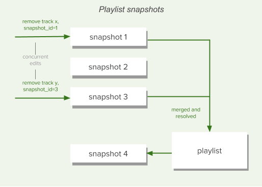

# Playlists

Playlists are containers for tracks and episodes. Spotify’s users have already created over 1.5 billion of them. By creating a playlist, a Spotify user can specify a subset of tracks and episodes; and the order in which to play them.

Through context menus and through support for drag-and-drop actions, the Spotify music players provide users with various controls for manually working with playlists. Playlists can be shared with, and followed by, other users, and they can be made available offline and used to seed other Spotify services, like radio.


<br>

## Public, Private, and Collaborative Status

When [creating](https://developer.spotify.com/documentation/web-api/reference/create-playlist) or [updating](https://developer.spotify.com/documentation/web-api/reference/change-playlist-details) a playlist through the Spotify Web API, setting the attribute “public” to true will publish the playlist on the user’s profile, which means it will appear under “public playlists”. This will also make the playlist visible in search results.

A playlist created through the WebAPI will have the “public” attribute set to true by default and setting it to false does the opposite, it won’t be displayed on the user’s profile and won’t be visible through search results

Requests to these endpoints require different scopes depending on the status of this attribute, `playlist-modify-public` is required when setting it to true and `playlist-modify-private` when setting it to false. When [creating](https://developer.spotify.com/documentation/web-api/reference/create-playlist) a new playlist, the default value of the public attribute is true, which means unless this attribute is explicitly set to false, creating a playlist requires the `playlist-modify-public` scope.

Note that the public attribute does not refer to access control, modifying access is currently not possible through the WebAPI, so anyone with the link to the playlist can access it unless it’s made private through for instance the desktop client.

A playlist can also be made collaborative through the WebAPI, by setting the “collaborative” attribute to true. This means that anyone with the link can add to or remove a track from it. When [creating](https://developer.spotify.com/documentation/web-api/reference/create-playlist) a new playlist, the default value of the collaborative attribute is false

Note that this is slightly different from adding/removing collaborators, which is currently not possible through the WebAPI. You can read more about adding/removing collaborators [here](https://support.spotify.com/us/article/collaborative-playlists/).

Furthermore, a playlist cannot have both the “collaborative” attribute and the “public” attribute set to true at the same time, so in order to set one of them to true the other must be set to false. Basically, a playlist cannot be both collaborative and published at the same time.

<br>

## Reading a Playlist

To read a playlist, we first need to find it, and for that we need its [Spotify ID](https://developer.spotify.com/documentation/web-api/concepts/spotify-uris-ids). The [Get a List of a User’s Playlists](https://developer.spotify.com/documentation/web-api/reference/get-list-users-playlists) gives us an easy way to get basic details about a user’s playlists, including their IDs. This is, the playlists the user owns and the playlists the user is following, excluding collaborative playlists owned by other users. The set of playlists will be determined by the scopes granted to the application:

-   Owned and followed non-collaborative public playlists will be returned
-   Owned and followed non-collaborative private playlists will only be returned when the scope `playlist-read-private` has been granted
-   Owned and followed collaborative playlists will only be returned when the scope `playlist-read-collaborative` has been granted

Once we have a list of playlists we can retrieve the details of a specific playlist using the Web API’s [Get a Playlist](https://developer.spotify.com/documentation/web-api/reference/get-playlist) endpoint, and a list of its items using [Get a Playlist’s Items](https://developer.spotify.com/documentation/web-api/reference/get-playlists-tracks). This last endpoint returns, in addition to an array of track and episode objects (depending on the `additional_types` parameter), information about who added the item and when it was added. (The items themselves are wrapped in a paging object to make it easy to retrieve very large playlists when necessary.)

<br>

## Local Files

Spotify allows you to play your own collection of music files from within the Spotify client. These tracks appear alongside the music available on Spotify and can be included in users’ playlists, even if that particular track is not available on Spotify itself. For more information on local files, please read our [support article](https://support.spotify.com/article/local-files/).

The Web API can retrieve the contents of playlists, including information on any local files that have been added, via the [Playlist endpoints](https://developer.spotify.com/documentation/web-api/reference/get-playlist).

<br>

### Identifying Local Files

Requesting the contents of a playlist returns a set of track objects along with extra information about that track’s instance in the playlist. For example:

```json linenums="1"
{
	"added_at": "2015-01-25T07:51:45Z",
	"added_by": {
		"external_urls": {
		"spotify": "http://open.spotify.com/user/exampleuser"
	},
	"href": "https://api.spotify.com/v1/users/exampleuser",
	"id": "exampleuser",
	"type": "user",
	"uri": "spotify:user:exampleuser"
},
"is_local": true,
"track": {
	[Spotify Track Object]
}
```

The key part here is the new property "`is_local`" which should be used to determine whether the track is a local file.

<br>

### The Track Object for a Local File

The structure of a Spotify track object for a local file is identical to that of a regular Spotify track, with some notable differences in available data:

-   A number of fields will always be empty, zero, false or null
-   Some fields are populated from available local file information
-   The track URI has a special formatting

```json linenums="1"
"track": {
	"album": {
		"album_type": null,
		"available_markets": [],
		"external_urls": {},
		"href": null,
		"id": null,
		"images": [],
		"name": "Donkey Kong Country: Tropical Freeze",
		"type": "album",
		"uri": null
	},
	"artists": [
		{
			"external_urls": {},
			"href": null,
			"id": null,
			"name": "David Wise",
			"type": "artist",
			"uri": null
		}
	],
	"available_markets": [],
	"disc_number": 0,
	"duration_ms": 127000,
	"explicit": false,
	"external_ids": {},
	"external_urls": {},
	"href": null,
	"id": null,
	"name": "Snomads Island",
	"popularity": 0,
	"preview_url": null,
	"track_number": 0,
	"type": "track",
	"uri": "spotify:local:David+Wise:Donkey+Kong+Country%3A+Tropical+Freeze:Snomads+Island:127"
 }
}
```

The local file information is read by the client software when the file was added to the playlist.

Although as much information as possible is taken from the local file, some may be missing so this information is not guaranteed to exist for all local files.

<br>

### Understanding the Local File URI

The local file URI is constructed from information extracted from the local file when it was added to the playlist as follows:

`spotify:local:{artist}:{album_title}:{track_title}:{duration_in_seconds}`

All available information is also used to populate the object album name, artist name, track name and track duration properties, so parsing this directly should not be necessary.

<br>

### How Should I Render Local Files to the User?

Whether you display these files to your app’s users is entirely dependent on the functionality that you require in your app. Initially, you could “grey out” the tracks or hide them altogether.

If you have access to the filesystem, you could use the information to match the track to the file and replicate the Spotify clients’ behaviour. Or perhaps use the title and artist information to [perform a search](https://developer.spotify.com/documentation/web-api/reference/search) in the Spotify catalogue.

<br>

### Limitations

It is not currently possible to add local files to playlists using the Web API, but they can be [Reordered](https://developer.spotify.com/documentation/web-api/reference/reorder-or-replace-playlists-tracks) or [Removed](https://developer.spotify.com/documentation/web-api/reference/remove-tracks-playlist). The latter should be done by specifying the `index` and `snapshot_id`, and NOT the URI of the track.

<br>

## Folders

Folders are not returned through the Web API, nor can be created using it.

<br>

## Version Control and Snapshots

The Web API provides several endpoints that allow playlists to be modified. These include [Add Items to a Playlist](https://developer.spotify.com/documentation/web-api/reference/add-tracks-to-playlist), [Remove Items from a Playlist](https://developer.spotify.com/documentation/web-api/reference/remove-tracks-playlist), [Replace a Playlist’s Items](https://developer.spotify.com/documentation/web-api/reference/reorder-or-replace-playlists-tracks) and [Reorder a Playlist’s Items](https://developer.spotify.com/documentation/web-api/reference/reorder-or-replace-playlists-tracks).

Every change to a playlist is saved in its version history. This makes possible features such as offline availability and collaborative editing, and [restoring an accidentally removed playlist](https://www.spotify.com/account/recover-playlists/). Every time you add, remove, or move a track, your modification is applied on top of all previous modifications, causing the playlist to enter a new state known as a **snapshot**.



If you need it, the Spotify Web API allows you to leverage snapshots to handle concurrent changes. Web API playlist endpoints like [Create a Playlist](https://developer.spotify.com/documentation/web-api/reference/create-playlist) and [Get a Playlist](https://developer.spotify.com/documentation/web-api/reference/get-playlist), return a **snapshot_id** in the response body. This can be used later to identify the specific playlist version to target for changes when, for example, [Removing Items from a Playlist](https://developer.spotify.com/documentation/web-api/reference/remove-tracks-playlist). Concurrent changes are then automatically merged into the latest playlist version.

<br>

## Following and Unfollowing a Playlist

Playlists can be followed or unfollowed programmatically through the [Follow a Playlist](https://developer.spotify.com/documentation/web-api/reference/follow-playlist) and [Unfollow a Playlist](https://developer.spotify.com/documentation/web-api/reference/unfollow-playlist) endpoints. Any playlist can be followed — public, private, and collaborative — provided you know the owner’s and the playlist’s Spotify IDs. When a user follows a playlist, the playlist’s owner will receive a notification in their Spotify client. When a track is added to a playlist, its followers will receive a notification in their Spotify client.

We have no endpoint for deleting a playlist in the Web API; the notion of deleting a playlist is not relevant within the Spotify’s playlist system. Even if you are the playlist’s owner and you choose to manually remove it from your own list of playlists, you are simply unfollowing it. Although this behavior may sound strange, it means that other users who are already following the playlist can keep enjoying it. [Manually restoring a deleted playlist](https://www.spotify.com/se/account/recover-playlists/) through the Spotify Accounts Service is the same thing as following one of your own playlists that you have previously unfollowed.

<br>

## Using Playlist Images

Every playlist has an associated set of images which can be retrieved through Web API endpoints like [Get a Playlist](https://developer.spotify.com/documentation/web-api/reference/get-playlist). In most cases there will be one image in a variety of sizes and the image will be a mosaic created from the album covers for the first few tracks:


The images array that’s returned can vary depending on how many tracks are in the playlist, and if the playlist has been manually “annotated”. The images array can contain:

-   Nothing, if the playlist has no tracks and is empty,
-   An album cover of size 640×640, if the playlist contains 1 to 3 tracks or has tracks from less than 4 different albums,
-   Three mosaic images of size 640×640, 300×300, and 60×60, if the playlist contains tracks from 4 or more albums,
-   A single custom image ([example](http://open.spotify.com/user/thelinmichael/playlist/3EsfV6XzCHU8SPNdbnFogK)) in various sizes, if the playlist image has been set manually — for example, for some curated playlists.

The JSON returned by the Web API endpoints includes both the image dimensions (largest first) and a temporary link to the images:

```json linenums="1"
...

"images" : [ {
"height" : 640,
"url" : "https://mosaic.scdn.co/640/e337f3661f68bc4d96a554de0ad7988d65edb25a134cd5ccaef9d411eba33df9542db9ba731aaf98ec04f9acee17a7576f939eb5aa317d20c6322494c4b4399d9b7c6f61b6a6ee70c616bc1a985c7ab8",
"width" : 640
}, {
"height" : 300,
"url" : "https://mosaic.scdn.co/300/e337f3661f68bc4d96a554de0ad7988d65edb25a134cd5ccaef9d411eba33df9542db9ba731aaf98ec04f9acee17a7576f939eb5aa317d20c6322494c4b4399d9b7c6f61b6a6ee70c616bc1a985c7ab8",
"width" : 300
}, {
"height" : 60,
"url" : "https://mosaic.scdn.co/60/e337f3661f68bc4d96a554de0ad7988d65edb25a134cd5ccaef9d411eba33df9542db9ba731aaf98ec04f9acee17a7576f939eb5aa317d20c6322494c4b4399d9b7c6f61b6a6ee70c616bc1a985c7ab8",
"width" : 60
} ],

...

```

!!! info

    Be aware that the links will expire in less than one day.

The use of album artwork in your applications is covered by our [Developer Terms of Service](https://developer.spotify.com/terms). In particular you should be aware that:

-   You must display the album artwork in the form that we provide it (although you can resize it),
-   You should not store album artwork except when it is strictly necessary to operate your application, and
-   You must provide a link close to the cover art back to the full length track on Spotify. We provide [design](https://developer.spotify.com/documentation/design) resources to help you with this.
