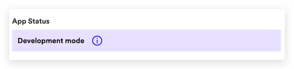
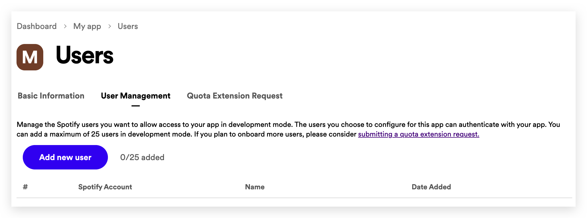
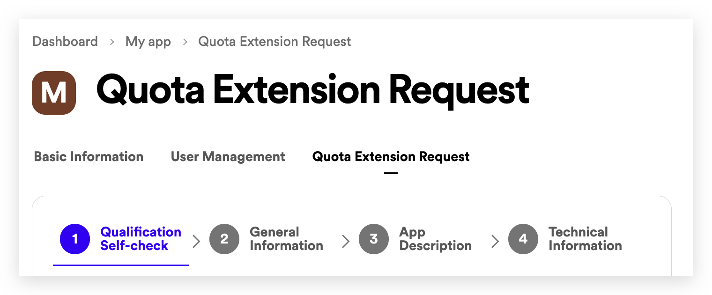

# Quota modes

The quota mode refers to the mode in which an app can be: **development mode** or **extended quota mode**.

You can check the current mode of your app by checking the _App Status_ value in the _App Settings_:

 

## Development mode

Newly-created apps begin in **development mode**. This mode is perfect for apps that are under construction and apps that have been built for accessing or managing data in a single Spotify account.

Up to 25 authenticated Spotify users can use an app that is in development mode — so you can share your app with beta testers, friends, or with fellow developers who are working on the app. Each Spotify user who installs your app will need to be added to your app's allowlist before they can use it.

 

### Adding a user to your app's allowlist

Allow another user to use your development mode app by following these steps:

1. Log in to the [Developer Dashboard](https://developer.spotify.com/dashboard)
2. Tap on the name of your app
3. Tap on the _Settings_ button
4. Tap on the _Users Management_ tab
   
5. Tap on the _Add new user_ button and enter the name and Spotify email address of the user that you want to enable to use your app
6. Invite the new user to install and use your app

Users may be able to log into a development mode app without having been allowlisted by the developer. However, API requests with an access token associated to that user and app will receive a 403 status code error

 

### Extended quota mode

Extended quota mode is for Spotify apps that are ready for a wider audience. Apps in this category can be installed by an unlimited number of users and the allowlist in development mode no longer applies. Extended quota mode apps also have access to a higher [rate limit](https://developer.spotify.com/documentation/web-api/concepts/rate-limits) than development mode apps do.

### Moving from development mode into extended quota mode

You can ask Spotify to move your app from development mode into extended quota mode. Spotify's app review team will take a look at your app and evaluate it for compliance with our [Developer Policy](https://developer.spotify.com/policy).

1. Log in to the [Developer Dashboard](https://developer.spotify.com/dashboard)
2. Tap on the name of your app
3. Tap on the _Settings_ button
4. Tap on the _Quota extension Request_ tab
   
5. Tell us about your app by filling out the provided questionnaire (4 steps)
6. Tap Submit

When you have successfully submitted your app for review you should see the word 'Sent' in blue on your app detail page. The app review team will review the information that you have provided, test out your app and send you feedback by email, to the email address associated with your Spotify account. This review process can take up to six weeks.
