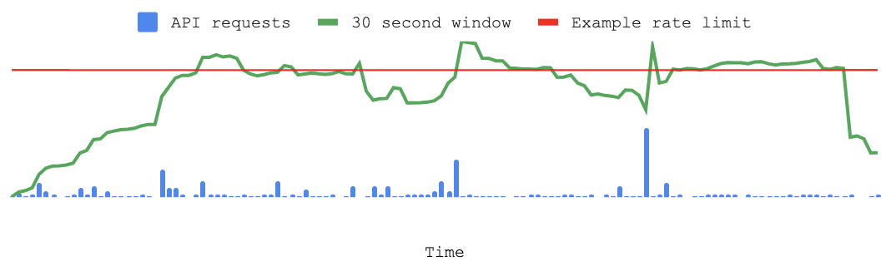

# Rate Limits

If your app makes a lot of Web API requests in a short period of time then it may receive a 429 error response from Spotify. This indicates that your app has reached our Web API rate _limit_. The Web API has rate limits in order to keep our API reliable and to help third-party developers use the API in a responsible way.

 

## Spotify's rate limit

Spotify's API rate limit is calculated based on the number of calls that your app makes to Spotify in a rolling 30 second window. If your app exceeds the rate limit for your app then you'll begin to see 429 error responses from Spotify's Web API, and you may hear from users about unexpected behavior that they have noticed while using your app. The limit varies depending on whether your app is in development mode or extended quota mode.

In the chart above, the app will receive an error response for the periods of time where the 30 second window exceeds the example rate limit in red.

 

### Exceptions

Be aware that Spotify does sometimes implement other limits outside of the API-wide rate limit. A few API endpoints, like the playlist image upload endpoint, have a custom rate limit that may differ from your app-wide rate limit. See the body of your API response from Spotify for more information about the error that you have received.

 

## Building your app with rate limits in mind

Every app is different and you'll want to plan your app architecture and user experience with rate limits in mind. Here are a few techniques that can help you design an app that works well with Spotify's Web API rate limits:

 

### Apply for extended quota mode

If your app is meant to be used by many Spotify users at the same time then you should apply for [extended quota mode](Quota-modes.md). Apps in this mode have a rate limit that is much higher than apps in development mode, the default mode for new apps. You can apply for a quota extension by opening your app detail page in the [Developer Dashboard](https://developer.spotify.com/dashboard) and tapping on the Request Extension link.

 

### Develop a backoff-retry strategy

When your app has been rate limited it will receive a 429 error response from Spotify. Your app can use this information as a cue to slow down the number of API requests that it makes to the Web API. The header of the 429 response will normally include a `Retry-After` header with a value in seconds. Consider waiting for the number of seconds specified in `Retry-After` before your app calls the Web API again.

 

### Use batch APIs to your advantage

Spotify has some APIs — like the [Get Multiple Albums](https://developer.spotify.com/documentation/web-api/reference/get-multiple-albums) endpoint — that allow you to fetch a batch of data in one API request. You can reduce your API requests by calling the batch APIs when you know that you will need data from a set of objects.

 

### Use the snapshot_id

Playlist APIs expose a `snapshot_id` that corresponds to the version of the playlist that you are working with. Downloading a playlist can be expensive so some apps may want to store and refer to the `snapshot_id` to avoid refreshing an entire playlist that has not changed. You can learn more about `snapshot_id` in our [Working with Playlists](https://developer.spotify.com/documentation/web-api/concepts/playlists) guide.

 

### Study your app's request patterns

When you load your app's detail page in the [Developer Dashboard](https://developer.spotify.com/dashboard) you'll find a graph that can tell you about your API request volume over time. Understanding anomalies in API requests — and the reasons for them — can help you find ways to avoid hitting the rate limit. For example, if you notice that your website receives a surge in traffic after you send out your weekly newsletter then you might decide that you want to stagger the delivery of those emails over the course of a day.

For more advanced insights into your app's request patterns, consider tracking your app's API calls to Spotify using your own logging tools.

 

### Consider 'lazy loading' features

Users often don't want to use every feature that is available to them on a web page, or in the view of a mobile app. You can avoid making API requests by making API calls conditional on user interactions, like tapping on a 'learn more' link, or scrolling to a defined region of a web page.
