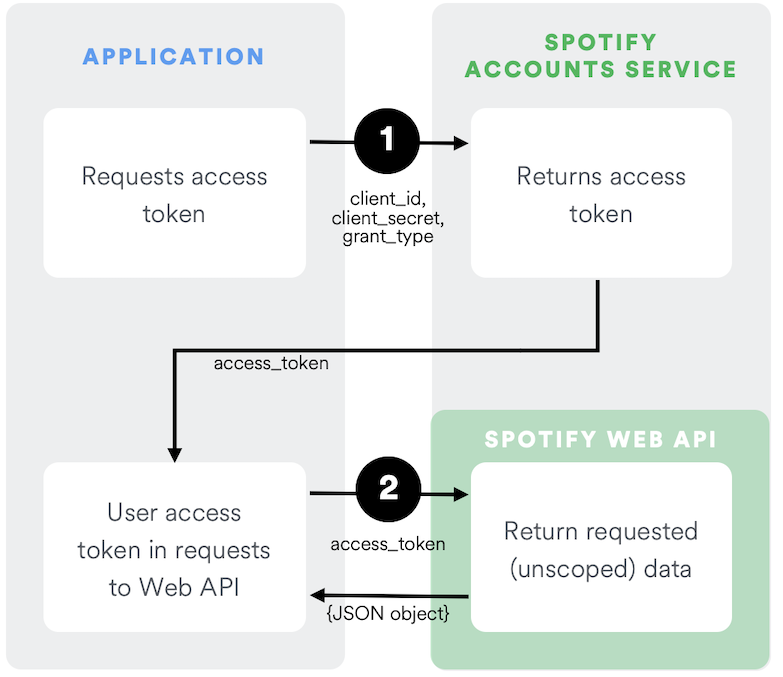

# Client Credentials

The Client Credentials flow is used in server-to-server authentication. Since this flow does not include authorization, only endpoints that do not access user information can be accessed.

The following diagram shows how the _Client Credentials Flow_ works:



<br>

#### Pre-requisites

This guide assumes that:

-   You have read the [authorization guide](../concepts/Authorization.md).
-   You have created an app following the [apps guide](../concepts/Apps.md).

<br>

#### Source Code

You can find an example app implementing Client Credentials flow on GitHub in the [web-api-examples](https://github.com/spotify/web-api-examples/tree/master/authorization/client_credentials) repository.

<br>

## Request authorization

The first step is to send a `POST` request to the `/api/token` endpoint of the _Spotify OAuth 2.0_ Service with the following parameters encoded in `application/x-www-form-urlencoded`:

| Body Parameters | Relevance  | Value                         |
| --------------- | ---------- | ----------------------------- |
| grant_type      | _Required_ | Set it to client_credentials. |

The headers of the request must contain the following parameters:

| Header Parameter | Relevance  | Value                                                                                                                                                                     |
| ---------------- | ---------- | ------------------------------------------------------------------------------------------------------------------------------------------------------------------------- |
| Authorization    | _Required_ | Base 64 encoded string that contains the client ID and client secret key. The field must have the format: `Authorization: Basic <base64 encoded client_id:client_secret>` |
| Content-Type     | _Required_ | Set to `application/x-www-form-urlencoded`.                                                                                                                               |

The following JavaScript creates and sends an authorization request:

```js linenums="1"
var client_id = 'CLIENT_ID';
var client_secret = 'CLIENT_SECRET';

var authOptions = {
	url: 'https://accounts.spotify.com/api/token',
	headers: {
		Authorization: 'Basic ' + new Buffer.from(client_id + ':' + client_secret).toString('base64'),
	},
	form: {
		grant_type: 'client_credentials',
	},
	json: true,
};

request.post(authOptions, function (error, response, body) {
	if (!error && response.statusCode === 200) {
		var token = body.access_token;
	}
});
```

<br>

### Response

If everything goes well, you'll receive a response with a `200 OK` status and the following JSON data in the response body:

| key          | Type   | Description                                                                                        |
| ------------ | ------ | -------------------------------------------------------------------------------------------------- |
| access_token | string | An access token that can be provided in subsequent calls, for example to Spotify Web API services. |
| token_type   | string | How the access token may be used: always "Bearer".                                                 |
| expires_in   | int    | The time period (in seconds) for which the access token is valid.                                  |

For example:

```linenums="1"
{
	"access_token": "NgCXRKc...MzYjw",
	"token_type": "bearer",
	"expires_in": 3600
}
```

<br>

## What's next?

Learn how to use an access token to fetch data from the Spotify Web API by reading the [access token guide](../concepts/Access-Token.md).
