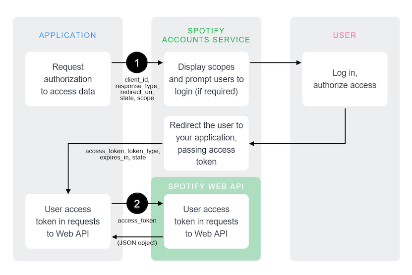

# Implicit Grant

!!! Info

    The implicit grant flow has some significant security flaws, so we strongly advise against using this flow. If you need to implement authorization where storing your client secret is not possible, use [Authorization code with PKCE](Authorization-code-PKCE.md) instead.

The implicit grant flow is carried out on the client side and it does not involve secret keys. Thus, you do not need any server-side code to use it. Access tokens issued are short-lived with no refresh token to extend them when they expire.

The following diagram shows how the _Implicit Grant Flow_ works:



<br>

#### Pre-requisites

This guide assumes that:

-   You have read the [authorization guide](../concepts/Authorization.md).
-   You have created an app following the [apps guide](../concepts/Apps.md).

<br>

#### Source Code

You can find an example app implementing Implicit Grant flow on GitHub in the [web-api-examples](https://github.com/spotify/web-api-examples/tree/master/authorization/implicit_grant) repository.

<br>

## Request User Authorization

Our application must build a `GET` request to the `/authorize` endpoint with the following parameters:

| Query Parameter | Relevance                             | Value                                                                                                                                                                                                                                                                                                                                                                                                                                                                                                                                                                                                                             |
| --------------- | ------------------------------------- | --------------------------------------------------------------------------------------------------------------------------------------------------------------------------------------------------------------------------------------------------------------------------------------------------------------------------------------------------------------------------------------------------------------------------------------------------------------------------------------------------------------------------------------------------------------------------------------------------------------------------------- |
| client_id       | _Required_                            | The client ID provided to you by Spotify when you register your application.                                                                                                                                                                                                                                                                                                                                                                                                                                                                                                                                                      |
| response_type   | _Required_                            | Set it to `token`.                                                                                                                                                                                                                                                                                                                                                                                                                                                                                                                                                                                                                |
| redirect_uri    | _Required_                            | The URI to redirect to after the user grants or denies permission. This URI needs to have been entered in the Redirect URI allowlist that you specified when you registered your application (See the [app guide](../concepts/Apps.md)). The value of `redirect_uri` here must exactly match one of the values you entered when you registered your application, including upper or lowercase, terminating slashes, and such.                                                                                                                                                                                                     |
| state           | _Optional, but strongly recommended._ | The state can be useful for correlating requests and responses. Because your `redirect_uri` can be guessed, using a state value can increase your assurance that an incoming connection is the result of an authentication request. If you generate a random string or encode the hash of some client state (e.g., a cookie) in this state variable, you can validate the response to additionally ensure that the request and response originated in the same browser. This provides protection against attacks such as cross-site request forgery. See [RFC-6749](https://datatracker.ietf.org/doc/html/rfc6749#section-10.12). |
| scope           | _Optional_                            | A space-separated list of [scopes](../concepts/Scopes.md).                                                                                                                                                                                                                                                                                                                                                                                                                                                                                                                                                                        |
| show_dialog     | _Optional_                            | Whether or not to force the user to approve the app again if they’ve already done so. If `false` (default), a user who has already approved the application may be automatically redirected to the URI specified by `redirect_uri`. If `true`, the user will not be automatically redirected and will have to approve the app again.                                                                                                                                                                                                                                                                                              |

The request is typically sent from the browser.

The following JavaScript sample builds the authorization request:

```js linenums="1"
var client_id = 'CLIENT_ID';
var redirect_uri = 'http://localhost:8888/callback';

var state = generateRandomString(16);

localStorage.setItem(stateKey, state);
var scope = 'user-read-private user-read-email';

var url = 'https://accounts.spotify.com/authorize';
url += '?response_type=token';
url += '&client_id=' + encodeURIComponent(client_id);
url += '&scope=' + encodeURIComponent(scope);
url += '&redirect_uri=' + encodeURIComponent(redirect_uri);
url += '&state=' + encodeURIComponent(state);
```

Once the request is processed, the user will see the authorization dialog asking to authorize access within the scopes.

The Spotify Accounts service presents details of the [scopes](../concepts/Scopes.md) for which access is being sought. If the user is not logged in, they are prompted to do so using their Spotify credentials. When the user is logged in, they are asked to authorize access to the resources or actions defined in the scopes.

Finally, the user is redirected back to your specified `redirect_uri`. After the user accepts, or denies your request, the Spotify OAuth 2.0 server redirects the user back to your `redirect_uri`. In this example, the redirect address is `https://localhost:8888/callback`

<br>

### Response

If the user grants access, the final URL will contain a _hash fragment_ with the following data encoded as a query string.

| Query Parameter | Value                                                                                              |
| --------------- | -------------------------------------------------------------------------------------------------- |
| access_token    | An access token that can be provided in subsequent calls, for example to Spotify Web API services. |
| token_type      | Value: "Bearer"                                                                                    |
| expires_in      | The time period (in seconds) for which the access token is valid.                                  |
| state           | The value of the state parameter supplied in authorization URI.                                    |

For example:

```linenums="1"
https://example.com/callback#access_token=NwAExz...BV3O2Tk&token_type=Bearer&expires_in=3600&state=123
```

If the user denies access, access token is not included and the final URL includes a query string containing the following parameters:

| Query Parameter | Value                                                          |
| --------------- | -------------------------------------------------------------- |
| error           | The reason authorization failed, for example: "access_denied". |
| state           | The value of the state parameter supplied in the request.      |

For example:

```linenums="1"
https://example.com/callback?error=access_denied&state=123
```

<br>

## What's next?

Learn how to use an access token to fetch data from the Spotify Web API by reading the [access token guide](../concepts/Access-Token.md).
